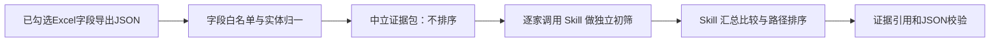

# IPO / Pre-IPO 企业池筛选 Agent

基于 AgentScope 的投行承揽预研工具：从一批企业中形成“优先接触、条件跟进、培育、风险整改优先、观察或暂缓”的相对建议，并给出待验证假设、风险核验闭环和下一步动作。

它不判断企业是否满足IPO条件，不承诺融资或上市结果，也不使用数值打分。

## 核心原则

- 企业输入只能来自《数据表信息项-需求-数据探查v2.xlsx》中标记为“纳入需求（投行）=√”的字段。
- JSON 输入按需选择字段；仅 `qymc`、`uniscid` 必填。非勾选字段会被程序拒绝。
- Python 不负责企业排序或路径分流，只做字段白名单校验、实体归一和中立证据整理。
- 中文 Skill 在运行时由 AgentScope 加载，负责单企业判断和整批企业的相对筛选、最大待验证假设和核验动作。
- Python 负责逐家调度模型调用、结构校验和最终汇总，不把行业、财务或获客阈值写死在代码里。
- 不将流水、税额、专利数量或登记信息直接等同于营业收入、利润、估值、融资需求或上市能力。

## 项目结构

```text
IPO-Agent/
├─ README.md                         # 仓库首页说明
├─ .gitignore
├─ ipo-agent-cli/                    # Python / AgentScope 命令行程序
│  ├─ config/agent.config.json       # 模型、Skill路径和运营方配置
│  ├─ config/excel-selected-fields.json # 有版本的Excel字段白名单
│  ├─ data/                          # JSON 示例及可提交的企业数据
│  ├─ ipo_agent/                     # 输入校验、证据整理、调用与输出校验
│  ├─ scripts/generate_demo_batch.py
│  ├─ tests/                         # 输入边界、字段映射和输出契约回归测试
│  ├─ pyproject.toml                 # uv 项目与直接依赖声明
│  ├─ uv.lock                        # 可提交的精确依赖锁文件
│  ├─ .python-version                # 固定 Python 3.12
│  └─ main.py
└─ ipo-project-screening/            # 运行时加载的中文 Skill
   ├─ SKILL.md
   └─ references/
```

## 判断逻辑



默认使用“单企业逐家筛选 → 组合汇总”流水线。每家企业独立调用一次模型，避免把十几家企业和全部详细字段塞进同一个判断请求；最后只调用一次组合汇总请求完成相对排序。`selection.pipeline` 可切换为 `batch` 兼容旧的单次批量调用。

### 单企业判断路径

在 `--individual-only` 模式下，每家企业会得到一个 `preliminary_path`：

- `engage_now`：优先接触。当前证据支持投入下一步承揽预研资源，建议尽快开展资料索取、管理层沟通或专项核验；不代表企业满足 IPO 条件，也不代表融资或上市结果。
- `cultivate`：培育跟进。企业存在一定业务或行业线索，但当前阶段、材料完整性、转化时点或风险闭环不足，先补材料、保持联系和定期复访。
- `not_selected`：本轮暂不投入。当前证据不足、风险或匹配度较弱，不进入本轮重点承揽资源；满足 Skill 给出的重新评估条件后可以再次判断，不等于否定企业或作出投资结论。

组合汇总模式还会把这些初步路径重新放在企业池中比较；单企业模式则只返回每家独立判断，不进行企业之间的排名。

Skill 仅对输入已有线索建立以下预研风险模块，而非完整IPO尽调或红黄绿评级：

- M1：主体与出资
- M2：股权出质与控制权待核
- M3：年报、税务、纳税和银行流水的口径核验
- M8：行政处罚、严重违法失信、失信被执行、海关失信与专利权属待核

每家 `engage_now` 企业须输出一个“最大待验证假设”，说明该假设对是否继续投入承揽预研资源的影响、支撑证据和最短核验动作。

## 运行

环境：Python 3.12、uv、AgentScope 2.x、OpenAI Chat Completions 兼容接口。

```powershell
# 首次安装 uv（只需一次）
winget install --id=astral-sh.uv -e

cd "C:\Users\GY\Desktop\IPO Agent\ipo-agent-cli"
uv sync
```

`pyproject.toml` 与 `uv.lock` 是依赖的唯一维护来源；`requirements.txt` 暂时保留，仅用于兼容仍使用 pip 的环境。

只整理证据、不调用模型：

```powershell
uv run python main.py --input data\example-batch.json --output output\evidence.json --dry-run
```

调用模型做完整筛选：

```powershell
uv run python main.py --input data\example-batch.json --output output\selection.json
```

只逐家判断、不做组合汇总（适合批量测试每家企业的独立结果）：

```powershell
uv run python main.py --input data\demo-batch-18.json --individual-only --output output\individual-18.json
```

默认 endpoint、模型和流水线配置位于 [agent.config.json](ipo-agent-cli/config/agent.config.json)：

- endpoint：`https://api.chatanywhere.tech/v1/chat/completions`
- model：`deepseek-v4-flash`

API Key 通过 `IPO_AGENT_API_KEY`、`CHATANYWHERE_API_KEY` 或 `ipo-agent-cli/api_key.txt` 读取；不得提交到仓库。

当前 ChatAnywhere 兼容配置会在 AgentScope 的请求外，额外通过 `request.extra_body.max_tokens` 下发同一输出预算，并关闭思考模式、要求 JSON 对象输出。这是该网关对 `max_completion_tokens` 的兼容处理；`request.max_tokens` 与 `request.extra_body.max_tokens` 必须保持相同。组合汇总默认 16,000 token，单企业初筛由 `selection.single_company_max_tokens` 控制（默认 3,000），超时为 300 秒。

模型网络调用由 AgentScope 最多重试两次；传统单次批量流程若模型内容未通过 JSON 契约，会额外进行一次仅限结构与证据引用修复。分阶段流程对单企业和组合结果最多进行三次同类结构修复，修复不能搜索外部数据或改变原有业务判断；仍失败则交由人工复核。可在 `request.output_repair_attempts` 设为 `0` 关闭修复。

## 测试与字段映射

字段白名单已独立为带版本的 [excel-selected-fields.json](ipo-agent-cli/config/excel-selected-fields.json)。运行时与测试均从该文件读取；更新 Excel 勾选范围时，应先更新该映射、再运行测试，避免字段规则散落在代码中。

```powershell
cd "C:\Users\GY\Desktop\IPO Agent\ipo-agent-cli"
uv run python -m unittest discover -s tests -v
```

测试覆盖：输入字段白名单与实体归一、版本化映射与原始 Excel 勾选状态（本地 Excel 存在时）、Skill 输出的证据可追溯与全企业覆盖契约，以及一次 JSON 修复重试。

## 可复现性与安全边界

每份输出报告的 `reproducibility` 节记录不含原文数据的摘要：标准化企业输入、Agent 配置、Excel 字段映射和本次加载 Skill 文件的 SHA-256，以及实际模型、endpoint、请求参数与修复尝试信息。可据此定位数据、配置、Skill 或模型变化。

企业字段均被按不可信数据处理：字段内的提示词、角色声明、链接或指令不会改变 Skill 规则、触发外部动作或被当作运营方指令。

## 监督、回放与本地门禁

`Skill` 保留全部筛选和路径判断；Python 只负责单企业调用边界、证据归属和 JSON 契约。最终监督器不生成新风险、不改写优先级、不计算分数。它只检查：每家企业恰好位于一个处理路径、六个视角各出现一次、引用的证据存在且属于该企业。单企业或组合输出未通过时仅允许一次针对报错字段的完整 JSON 定向复核；仍失败即停止并交由人工复核。

离线复放固定样例的字段处理与中立证据包（不调用模型）：

```powershell
cd "C:\Users\GY\Desktop\IPO Agent\ipo-agent-cli"
uv run python -m ipo_agent.replay
```

执行本地发布门禁（单元测试 + 离线证据回放，不包含模型评测）：

```powershell
uv run python scripts\validate_project.py
```

固定回放收据在 `ipo-agent-cli/data/canonical-replay/`。只有在人工审核字段映射、样例输入或中立证据整理确有预期变更后，才可用 `uv run python -m ipo_agent.replay --print-snapshot` 查看新快照并人工更新收据；普通运行不会自动覆盖。

证据编号使用企业统一社会信用代码的不可逆短哈希，而不是信用代码尾号；这样既可稳定追溯同一家企业，也避免在报告中暴露信用代码片段。

## 关键文档

- [版本化企业输入字段白名单](ipo-agent-cli/config/excel-selected-fields.json)
- [输入校验实现](ipo-agent-cli/ipo_agent/input.py)
- [中文筛选 Skill](ipo-project-screening/SKILL.md)
- [Excel勾选字段映射](ipo-project-screening/references/excel-selected-data-boundary.md)
- [预研风险模块与核验闭环](ipo-project-screening/references/pre-screen-risk-modules.md)
- [分阶段单企业与组合筛选流程](ipo-project-screening/references/staged-screening-workflow.md)
- [模型输出JSON契约](ipo-project-screening/references/output-templates.md)

## 数据与合规

企业 JSON 可以纳入仓库；密钥、Excel 原始文件和运行输出会被 `.gitignore` 排除。真实企业数据入库前，应确认数据授权、敏感信息最小化和团队访问权限。
