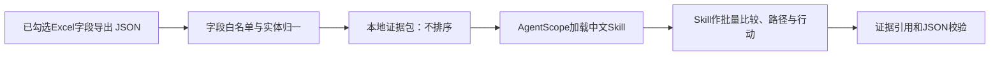

# IPO / Pre-IPO 企业池筛选 Agent

这是一个无前端、基于 AgentScope 的投行承揽预研工具。它从一批企业中提出“优先接触、条件跟进、培育、风险复核或暂缓”的相对建议，并列出核验材料与下一步动作；不判断企业是否符合IPO条件，也不承诺上市或融资结果。

## 数据原则：企业数据只来自勾选的Excel字段

企业输入JSON只能是《数据表信息项-需求-数据探查v2.xlsx》`Sheet1` 中标记为 **“纳入需求（投行）=√”** 的字段导出结果。

- 不接收 `lead_profile`、融资意向、估值、联系人、客户、订单、审计意见、IPO计划等范围外字段。
- 输入校验会直接拒绝任何非勾选字段，避免“悄悄补数据”。
- 水、电、燃气等含住址、用户号的高敏字段不会进入模型。
- 企业事实与运行配置严格分离：`config/agent.config.json` 中的 `top_k`、重点行业等仅是运营方偏好，不能补全企业事实。

完整字段映射见[Excel勾选字段边界](../ipo-project-screening/references/excel-selected-data-boundary.md)，程序白名单见[ipo_agent/input.py](ipo_agent/input.py)。

## 判断逻辑在哪

Python **不做打分、不做候选名单、不做路径分流**。它只做：

1. 校验JSON字段是否全部来自已勾选Excel范围；
2. 按统一社会信用代码归并重复企业；
3. 最小化敏感字段，并整理经营财务、股权出资、技术创新、合规、策略匹配五类证据卡；
4. 调用 AgentScope，由中文Skill对整批企业做相对判断、排序、最大待验证假设和风险核验闭环；
5. 校验模型输出的证据引用、企业唯一性、排名和JSON结构。

业务筛选逻辑全部在以下中文Skill文件中，可按投行团队的方法论调整，而无需改Python：

- [SKILL.md](../ipo-project-screening/SKILL.md)：边界、批量筛选流程与结论原则；
- [screening-framework.md](../ipo-project-screening/references/screening-framework.md)：五类证据卡、路径含义与比较顺序；
- [output-templates.md](../ipo-project-screening/references/output-templates.md)：模型输出JSON契约；
- [risk-workflow.md](../ipo-project-screening/references/risk-workflow.md)：单企业风险预核验参考。



## 运行环境

- Python 3.12
- AgentScope 2.x
- OpenAI Chat Completions兼容模型接口

安装依赖：

```powershell
cd "C:\Users\GY\Desktop\IPO Agent\ipo-agent-cli"
$python = "$env:LOCALAPPDATA\Programs\Python\Python312\python.exe"
& $python -m pip install -r requirements.txt
```

默认模型配置在[config/agent.config.json](config/agent.config.json)：

- endpoint：`https://api.chatanywhere.tech/v1/chat/completions`
- model：`deepseek-v4-flash`
- Skill：`../ipo-project-screening`

密钥从 `IPO_AGENT_API_KEY`、`CHATANYWHERE_API_KEY` 或项目根目录的 `api_key.txt` 读取。密钥不得放入JSON、配置或报告。

## 输入格式

仅支持JSON，且顶层只能是 `companies`。例如：

```json
{
  "companies": [
    {
      "basic_registration": {
        "qymc": "企业全称",
        "uniscid": "统一社会信用代码",
        "qyjc": "企业简称（可选）",
        "cyrs": 300,
        "zczb": 5000,
        "sjzb": 5000,
        "jyfw": "经营范围",
        "industrycogb": "行业标识"
      },
      "annual_reports": [
        {"vendinc": 1000, "progro": 120, "netinc": 90, "ratgro": 8, "liagro": 5}
      ],
      "shareholder_contributions": [
        {"gdlx": "企业法人", "czbl": 60, "sje": 3000, "rjcze": 3000}
      ],
      "patents": [{"ZLLX": "发明专利", "FMMC": "专利名称"}]
    }
  ]
}
```

`qymc` 与 `uniscid` 必填，其余已勾选字段可按实际导出结果提供。单条记录内如出现 `zt`、`projects`、`contacts`、`lead_profile` 等非白名单字段，程序会停止并提示具体字段。

## 运行

### 仅检查与整理证据（不调用模型）

```powershell
cd "C:\Users\GY\Desktop\IPO Agent\ipo-agent-cli"
$python = "$env:LOCALAPPDATA\Programs\Python\Python312\python.exe"
& $python main.py --input data\example-batch.json --output output\evidence.json --dry-run
```

该模式只输出来自Excel字段的证据包，不给企业贴“优先/培育/暂缓”标签。

### 完整批量筛选

```powershell
& $python main.py --input data\example-batch.json --output output\selection.json
```

AgentScope会加载中文Skill，由Skill决定是否选择企业、如何排序、哪些企业培育或暂缓；模型输出仍必须通过证据与JSON契约校验。

可临时切换模型或接口：

```powershell
& $python main.py --input data\example-batch.json --model deepseek-v4-flash
& $python main.py --input data\example-batch.json --endpoint "https://example.com/v1/chat/completions"
```

## 输出

输出报告包含：

- `pre_screening`：本地中立证据包，状态固定为 `evidence_prepared_for_skill`；
- `batch_project_selection`：仅完整运行时存在，由Skill形成的批量判断；
- `data_integrity_summary`：企业归一、数据边界和资料缺口；
- `provenance_by_company`：每家企业所用Excel表和字段。

每家优先接触企业还会形成一个“最大待验证假设”，并仅针对已有线索登记 M1（主体与出资）、M2（股权出质）、M3（财务口径核验）、M8（法律合规）风险模块。每项均包含筛选影响、待补材料、核验动作和核验时点；这不是正式IPO尽调结论或红黄绿评级。

当前勾选字段没有融资意向、估值、联系人或决策链。因此模型必须将估值、获客转化等写为待核实；不能生成带具体人名或融资痛点的个性化微信话术，`wechat_first_touch` 会是 `null`。

## 示例

- [example-batch.json](data/example-batch.json)：3家虚构企业，全部字段均在勾选范围内；
- [generate_demo_batch.py](scripts/generate_demo_batch.py)：生成18家虚构企业的批量回归数据；
- [demo-batch-18.json](data/demo-batch-18.json)：由生成脚本产出后可直接运行。

生成批量样例：

```powershell
& $python scripts\generate_demo_batch.py
& $python main.py --input data\demo-batch-18.json --output output\demo-evidence.json --dry-run
```

## 合规边界

本项目仅用于投行承揽、获客和立项预研。所有IPO资格、估值、融资意愿、收入确认、客户合同、审计、法律和税务事项均需取得相应授权材料后另行核验。
